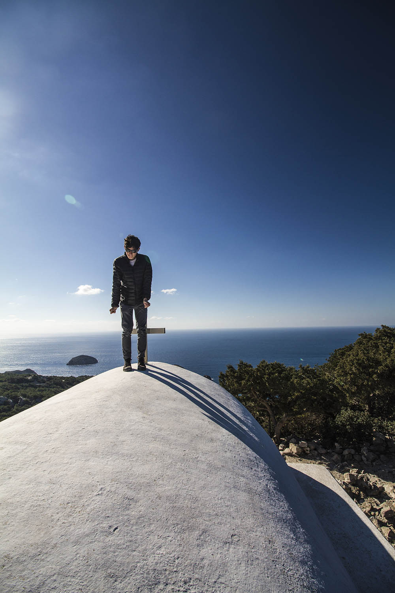

layout: page
title: me
date: 2016-07-24 14:56:20
tags: me
---

Monolithos, Greece - Feb 2016

# About Me

Hey, I'm Jono. I'm from New Zealand, and I'm currently studying Computer Science and Applied Mathematics at the [University of Auckland](https://www.auckland.ac.nz/). In my spare time, I make things (mostly software, sometimes video and other things), run & bike, and spend too much money (mostly on travelling 🚀).

In my spare time, I like to distract myself with side projects. I helped build [Gradiator](https://launchpad.net/gradiator) (a CSS gradients app), [Nitro](https://github.com/CaffeinatedCode/nitro) (a task management app) and [Lightread](https://github.com/stayradiated/LightRead), which [won the first Ubuntu App Showdown](http://www.omgubuntu.co.uk/2012/08/ubuntu-app-showdown-winners-announced). I also made [Stormcloud](https://github.com/consindo/stormcloud), a weather app that was [the best selling app in the Ubuntu Store ever](http://www.omgubuntu.co.uk/tag/stormcloud). Unfortunately software is hard to maintain, so after losing interest, all the apps are pretty much dead. On the positive side, they're all open source which means you can download, modify and almost anything you like with the code.

*But Jono, that was 2012-2013! What have you been doing since?* In 2014, I realized that building open source apps for the rest of your life isn't particularly profitable, so I put some effort into school, tried to get a few scholarships, and took a trip overseas. In 2015, I started University, finally started working on a new app, and then I took three months for another trip around the world.

Now it's 2016 and I'm almost 20. I'm still at University, but I'm working on another app now. It's called [Transfer](https://dymajo.com), it's an FTP + SFTP app, and we're going to release it soon (yes FTP is still great, just don't use it for deploying websites).

## Get in touch
I like talking to people! [Message me](https://m.me/jonocoopernz) if you just wanna chat, work together, or just wanna hang out. I also have [email](mailto:jono@jonocooper.com)!

I also have a [blog](/archives), a pretty uninteresting [Twitter](https://twitter.com/consindo), and a not very public [GitHub](https://github.com/consindo).

