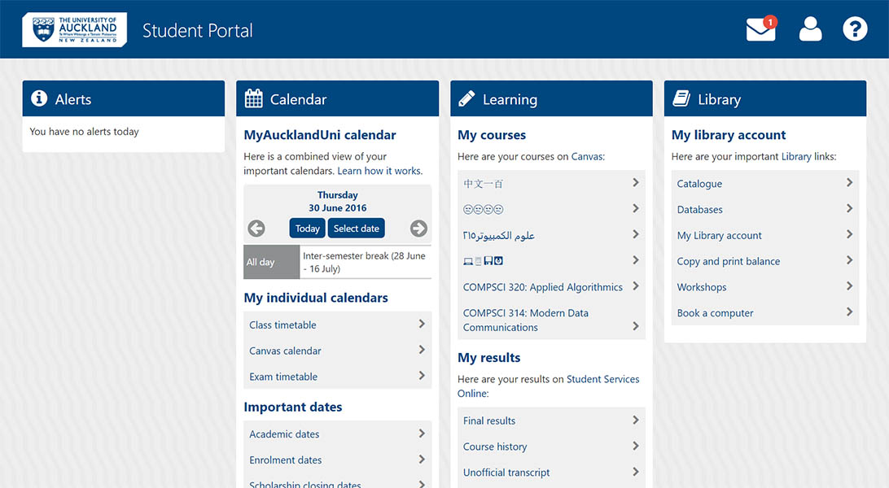
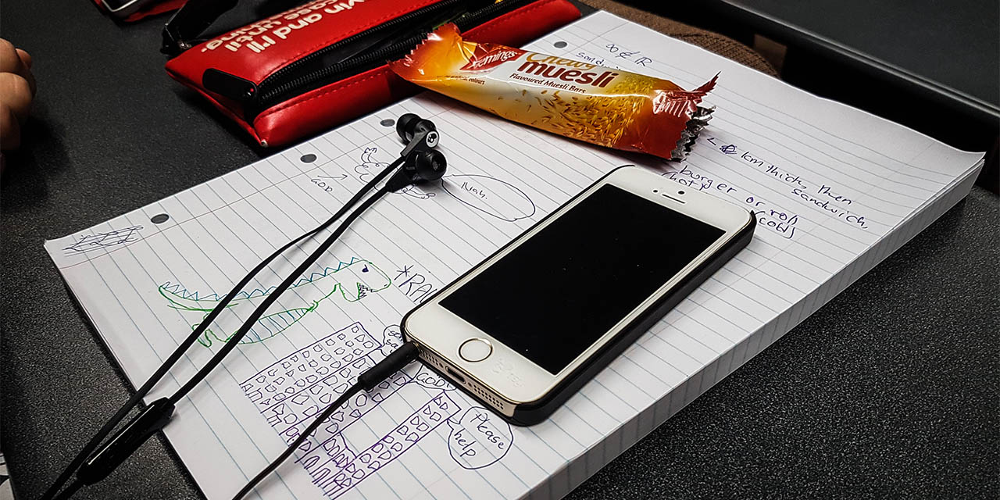

layout: page
title: projects
date: 2016-06-30 14:53:36
tags:
---
<header class="article-header"><h1 class="article-title" itemprop="name">projects</h1>
<h2>sometimes I make things</h2></header>

<main class="projects">
<section class="col">

<h2>MyAucklandUni Redesign<a href="" f="#">Get It</a></h2>

install this to prettify the student portal

</section><section class="col">

<h2>GPA Calculator<a href="#">Get It</a></h2>

work out what grade you need so you don't fail

</section>
</main>
